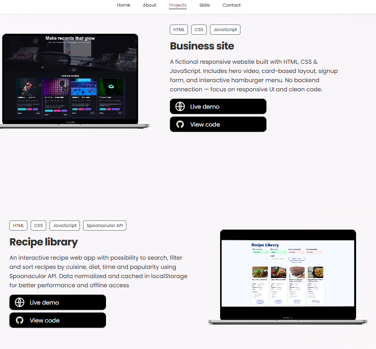

# Jennifer Jansson – Developer Portfolio

> A personal portfolio showcasing projects, skills, and ways to connect. Built with **React** and **styled-components**. Responsive design based on Figma. 

---

## Project Title & Description

**Developer Portfolio**

This app displays my tech stack, featured projects, and contact info. Tech used: React, Vite, styled-components, JSON. Challenges: responsive design, accessibility, dynamic content. Future plans will be to add more projects.

---

## Installation & Usage

Clone the repo, install dependencies, and start the dev server:

```bash
git clone https://github.com/JenniferJansson/portfolio.git
cd portfolio
npm install
npm run dev
```

---

## Screenshot



---

## Deployed Link

[Live Portfolio on Netlify](https://jeffies-portfolio.netlify.app/)

---

## Tech Stack

- React
- Vite
- JavaScript (ES6)
- styled-components
- JSON for content
